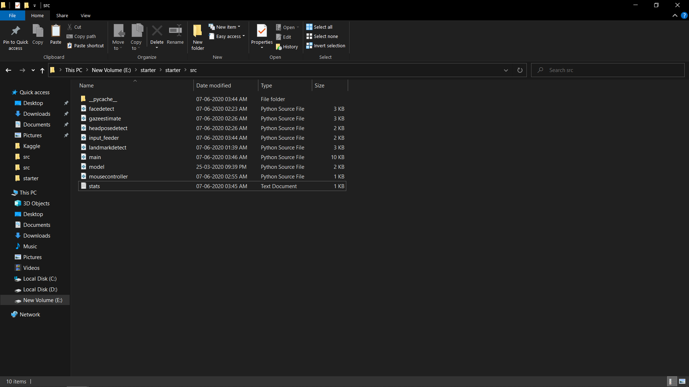

# Computer Pointer Controller

This project runs multiple models in the same machine and coordinate the flow of data between those models. In this project, we will use a gaze detection model to control the mouse pointer of your computer. We will be using the Gaze Estimation model to estimate the gaze of the user's eyes and change the mouse pointer position accordingly.

## Project Set Up and Installation

1) Download and install Intel OpenVino Toolkit 

2) Copy these files in the directories as stored here.

3) Initialize the openvino toolkit by <br>
```
    "C:\Program Files (x86)\IntelSWTools\openvino\bin\setupvars.bat"
```
4) Download the required models using the following commands:

1st Face Detection Model:-
```
    python "C:\Program Files (x86)\IntelSWTools\openvino_2020.3.194\deployment_tools\tools\model_downloader\downloader.py" --name "face-detection-adas-binary-0001"
```
2nd Facial Landmarks Detection Model:-
```
    python "C:\Program Files (x86)\IntelSWTools\openvino_2020.3.194\deployment_tools\tools\model_downloader\downloader.py" --name "landmarks-regression-retail-0009"
```
3rd Head Pose Estimation Model:-
```
    python "C:\Program Files (x86)\IntelSWTools\openvino_2020.3.194\deployment_tools\tools\model_downloader\downloader.py" --name "head-pose-estimation-adas-0001"
```     
4th Gaze Estimation Model:-
```    
    python "C:\Program Files (x86)\IntelSWTools\openvino_2020.3.194\deployment_tools\tools\model_downloader\downloader.py" --name "gaze-estimation-adas-0002"
```

## Demo

1) Change the directory to src directory of project <br>
```
cd <project-path>/src
```
2) Run the main.py file
Example:<br>
```
python main.py  -fd "C:\Program Files (x86)\IntelSWTools\openvino_2020.3.194\deployment_tools\open_model_zoo\tools\downloader\intel\face-detection-adas-binary-0001\FP32-INT1\face-detection-adas-binary-0001" -ld "C:\Program Files (x86)\IntelSWTools\openvino_2020.3.194\deployment_tools\open_model_zoo\tools\downloader\intel\landmarks-regression-retail-0009\FP16\landmarks-regression-retail-0009" -hp "C:\Program Files (x86)\IntelSWTools\openvino_2020.3.194\deployment_tools\open_model_zoo\tools\downloader\intel\head-pose-estimation-adas-0001\FP16\head-pose-estimation-adas-0001" -ge "C:\Program Files (x86)\IntelSWTools\openvino_2020.3.194\deployment_tools\open_model_zoo\tools\downloader\intel\gaze-estimation-adas-0002\FP16\gaze-estimation-adas-0002" -i "E:\Github\Computer-Pointer-Controller\bin\demo.mp4"  
```
```
python main.py -fd <Path of xml file of face detection model>
-ld <Path of xml file of facial landmarks detection model>
-hp <Path of xml file of head pose estimation model>
-g <Path of xml file of gaze estimation model>
-i <Path of input video file or enter cam for taking input video from webcam> 
```
If you want to run app on GPU:-
```
python main.py -fd <Path of xml file of face detection model>
-ld <Path of xml file of facial landmarks detection model>
-hp <Path of xml file of head pose estimation model>
-g <Path of xml file of gaze estimation model>
-i <Path of input video file or enter cam for taking input video from webcam> 
-d GPU
```
If you want to run app on FPGA:-
```
python main.py -fd <Path of xml file of face detection model>
-ld <Path of xml file of facial landmarks detection model>
-hp <Path of xml file of head pose estimation model>
-g <Path of xml file of gaze estimation model>
-i <Path of input video file or enter cam for taking input video from webcam> 
-d HETERO:FPGA,CPU
```

## Documentation

Directory Structure of the project


\src folder contains all the source files:-

1. main.py : Users need to run main.py file for running the app.

2. facedetect.py: Contains preprocession of video frame, perform infernce on it and detect the face, postprocess the outputs.
     
3. Landmarkdetect.py: Takes the deteted face as input, preprocessed it, perform inference on it and detect the eye landmarks, postprocess the outputs.
     
4. headposedetect.py: Take the detected face as input, preprocessed it, perform inference on it and detect the head postion.
     
5. gazeestimate.py: Take the left eye, rigt eye, head pose angles as inputs, preprocessed it, perform inference and predict the gaze vector, postprocess the outputs.
     
6. input_feeder.py: Contains InputFeeder class which initialize VideoCapture as per the user argument and return the frames one by one.
     
7. mousecontroller.py: Contains MouseController class.
 
\bin folder contains demo video which user can use for testing the app.

Following are commands line arguments that can use for while running the main.py file ` python main.py `:-

  1. -h     (required) : Information about all the command.
  2. -fl    (required) : Path of Face Detection model's xml file.
  3. -hp    (required) : Path of Head Pose Estimation model's xml file.
  4. -g     (required) : Path of Gaze Estimation model's xml file.
  5. -i     (required) : Path of input video file or enter cam for taking input video from webcam.
  6. -d     (optional) : Target device to infer the video file on the model. Suppoerted devices are: CPU, GPU, FPGA, MYRIAD.
  7. -l     (optional) : Path of cpu extension if some layers of models are not supported on the device.
  8. -prob  (optional) : Probability threshold for face detection model to detect the face accurately.

## Benchmarks

For FP32: <br>
```
python main.py  -fd "C:\Program Files (x86)\IntelSWTools\openvino_2020.3.194\deployment_tools\open_model_zoo\tools\downloader\intel\face-detection-adas-binary-0001\FP32-INT1\face-detection-adas-binary-0001" -ld "C:\Program Files (x86)\IntelSWTools\openvino_2020.3.194\deployment_tools\open_model_zoo\tools\downloader\intel\landmarks-regression-retail-0009\FP32\landmarks-regression-retail-0009" -hp "C:\Program Files (x86)\IntelSWTools\openvino_2020.3.194\deployment_tools\open_model_zoo\tools\downloader\intel\head-pose-estimation-adas-0001\FP32\head-pose-estimation-adas-0001" -ge "C:\Program Files (x86)\IntelSWTools\openvino_2020.3.194\deployment_tools\open_model_zoo\tools\downloader\intel\gaze-estimation-adas-0002\FP32\gaze-estimation-adas-0002" -i "C:\Users\Harshit\Desktop\starter\starter\bin\demo.mp4"
```
For FP16:<br>
```
python main.py  -fd "C:\Program Files (x86)\IntelSWTools\openvino_2020.3.194\deployment_tools\open_model_zoo\tools\downloader\intel\face-detection-adas-binary-0001\FP32-INT1\face-detection-adas-binary-0001" -ld "C:\Program Files (x86)\IntelSWTools\openvino_2020.3.194\deployment_tools\open_model_zoo\tools\downloader\intel\landmarks-regression-retail-0009\FP16\landmarks-regression-retail-0009" -hp "C:\Program Files (x86)\IntelSWTools\openvino_2020.3.194\deployment_tools\open_model_zoo\tools\downloader\intel\head-pose-estimation-adas-0001\FP16\head-pose-estimation-adas-0001" -ge "C:\Program Files (x86)\IntelSWTools\openvino_2020.3.194\deployment_tools\open_model_zoo\tools\downloader\intel\gaze-estimation-adas-0002\FP16\gaze-estimation-adas-0002" -i "C:\Users\Harshit\Desktop\starter\starter\bin\demo.mp4"  
```
For GPU: Append -d GPU in the above command for the respective precesion.


Model loading time(sec):

    CPU
        FP32: 0.9127283096313477
        FP16: 0.9251008033752441
    GPU
        FP32: 72.72024512290955
        FP16: 75.96624970436096

Input/ Output processing time or FPS :

    CPU
        FP32: 0.6229233893042216
        FP16: 0.6220945609317073
    GPU
        FP32: 0.6188153297279008
        FP16: 0.6217199362001782

Model inference time(sec):

    CPU
        FP32: 94.71469688415527
        FP16: 94.84088706970215
    GPU
        FP32: 95.34346866607666
        FP16: 94.89803457260132

## Results

If we go from FP32 to FP16 accuracy will decrease due to lower prescison and GPU takes a lot more Model Loading Time than CPU rest all other parameters were considerably same in both the precisions for CPU and GPU.

### Edge Cases
Suppose face cannot be detected then it will print the model cannot detect the face and then it will proceed with the inference till the project is terminated by  the user.
